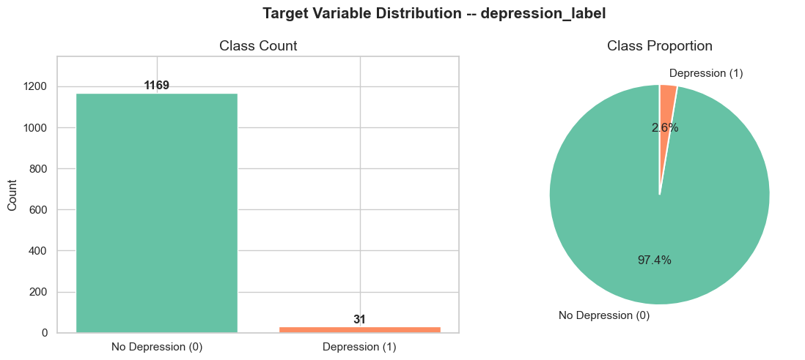
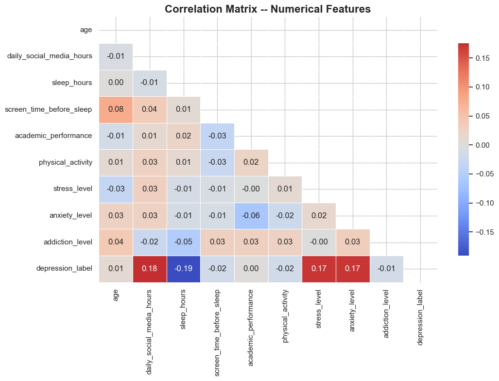
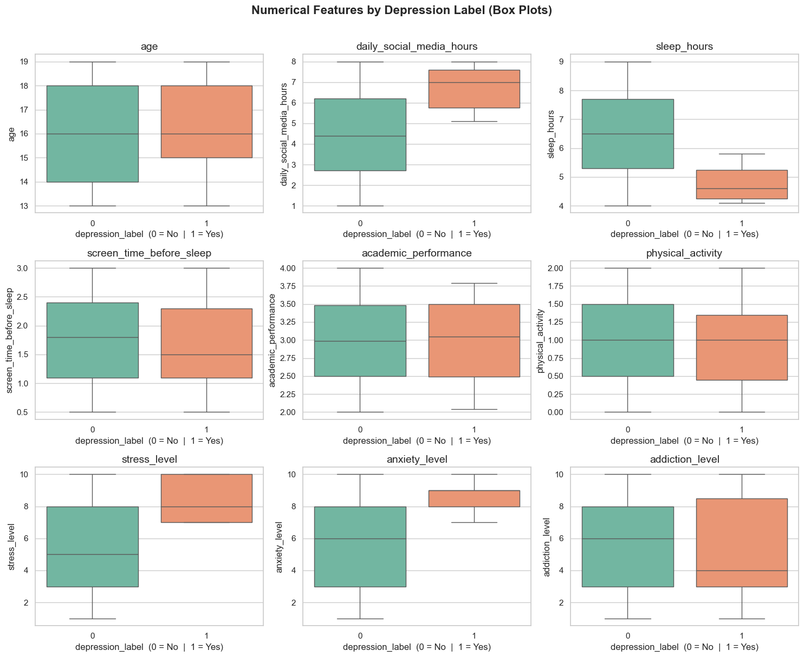
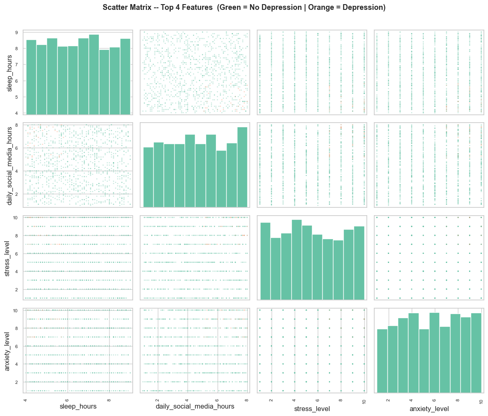
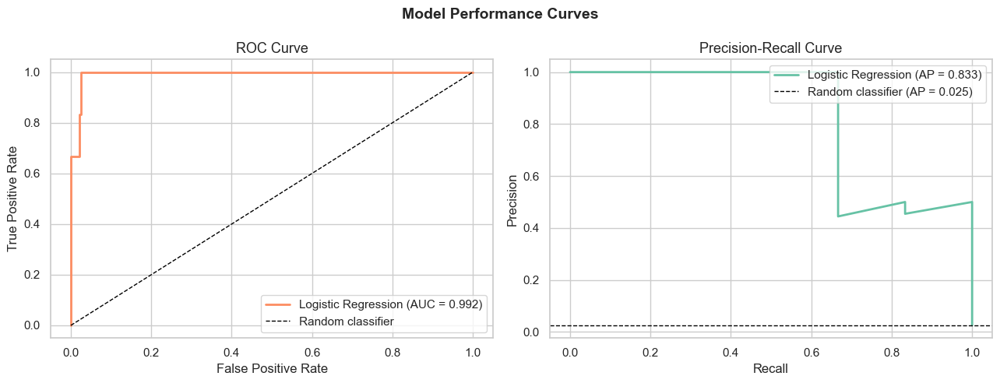
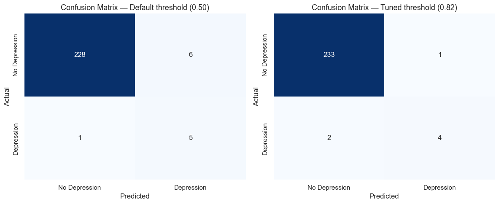
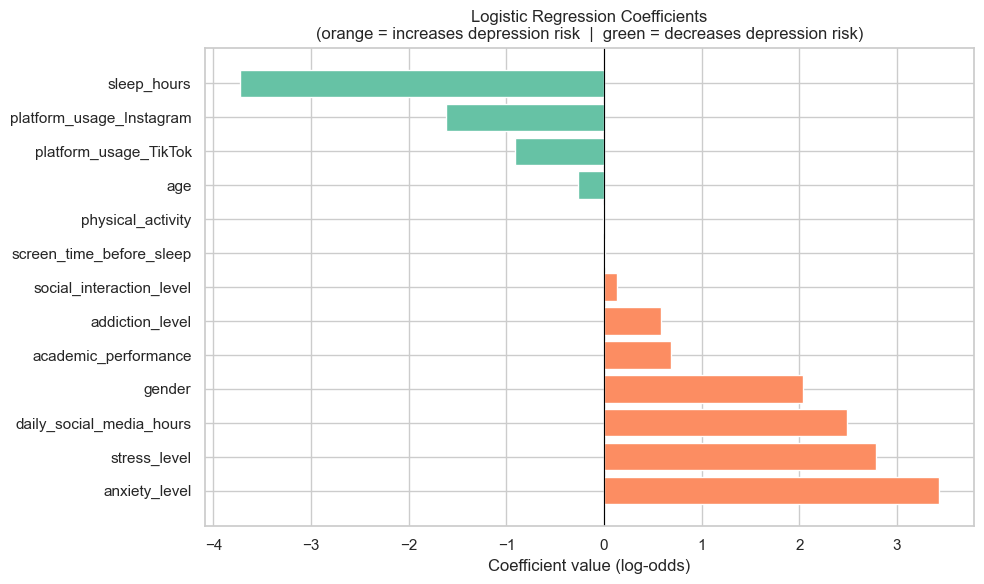
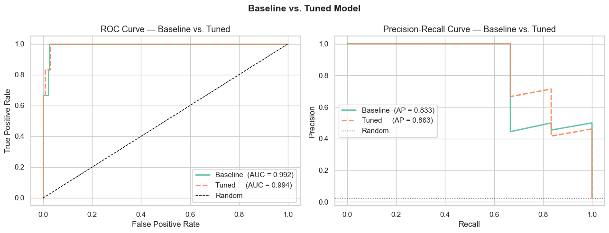
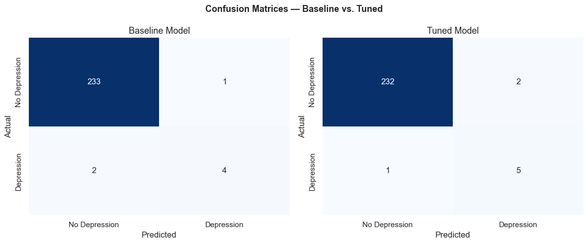

# BlueFlags

Predicting depression risk in teenagers based on social media usage and lifestyle habits using logistic regression.


---

## Overview

This project builds a binary classification pipeline to determine whether a teenager is at risk of depression (`depression_label`: 0 or 1). The dataset captures behavioral and lifestyle patterns — including daily social media consumption, sleep duration, academic performance, and self-reported stress levels — collected from approximately 1,200 adolescents.

The project follows a structured machine learning workflow: exploratory data analysis, preprocessing, model training, and evaluation.

---

## Problem Statement

Adolescent mental health has become a growing concern, with social media usage often cited as a contributing factor to rising rates of anxiety and depression. This project investigates whether behavioral and lifestyle variables can reliably predict depressive symptoms, using logistic regression as the primary model.

**Target variable:** `depression_label` — binary (0 = no depression, 1 = depression)

---

## Dataset

**File:** `data/Teen_Mental_Health_Dataset.csv`  
**Records:** 1,200

| Feature | Type | Description |
|---|---|---|
| `age` | Numeric | Age of the teenager (years) |
| `gender` | Categorical | Gender (male / female) |
| `daily_social_media_hours` | Numeric | Average hours per day spent on social media |
| `platform_usage` | Categorical | Primary social media platform used |
| `sleep_hours` | Numeric | Average hours of sleep per night |
| `screen_time_before_sleep` | Numeric | Hours of screen exposure before sleeping |
| `academic_performance` | Numeric | GPA-style academic score |
| `physical_activity` | Numeric | Hours of physical activity per week |
| `social_interaction_level` | Categorical | Level of in-person social interaction (low / medium / high) |
| `stress_level` | Numeric | Self-reported stress score (1–10) |
| `anxiety_level` | Numeric | Self-reported anxiety score (1–10) |
| `addiction_level` | Numeric | Social media addiction score (1–10) |
| `depression_label` | Binary | Target variable — 0: no depression, 1: depression |

---

## Exploratory Data Analysis

### Class Distribution

The dataset presents a severe **class imbalance**: 97.4% of records belong to class 0 (no depression) and only 2.6% to class 1 (depression). This imbalance is a critical constraint for modelling and must be addressed through resampling techniques before training.



---

### Correlation with the Target Variable

The heatmap below shows pairwise Pearson correlations among all numerical features. The last row highlights the relationship of each feature with `depression_label`.



The four strongest correlates with depression are:

| Feature | Correlation | Direction |
|---|---|---|
| `sleep_hours` | -0.191 | Less sleep is associated with higher depression risk |
| `daily_social_media_hours` | +0.175 | More time on social media correlates with depression |
| `stress_level` | +0.171 | Higher stress scores track closely with depression |
| `anxiety_level` | +0.170 | Higher anxiety scores track closely with depression |

---

### Feature Distributions by Class

Box plots reveal meaningful shifts in feature distributions between depressed and non-depressed teenagers. The most pronounced differences are observed in `stress_level`, `anxiety_level`, `sleep_hours`, and `daily_social_media_hours`.



**Mean values by class:**

| Feature | No Depression (0) | Depression (1) | Difference |
|---|---|---|---|
| `stress_level` | 5.37 | 8.48 | +3.11 |
| `anxiety_level` | 5.56 | 8.61 | +3.05 |
| `daily_social_media_hours` | 4.48 h | 6.72 h | +2.24 h |
| `sleep_hours` | 6.49 h | 4.76 h | -1.73 h |

---

### Scatter Matrix — Top Features

The scatter matrix below plots pairwise relationships among the four most correlated features, coloured by class. The overlap between classes is consistent with the weak-to-moderate correlation values, confirming that no single feature is sufficient for classification on its own.



---

## Key Findings

- **Severe class imbalance (97.4% vs 2.6%)** makes accuracy a misleading metric. ROC-AUC and F1-score will be the primary evaluation criteria.
- **Stress and anxiety levels** show the largest mean difference between classes (+3 points on a 1–10 scale), making them the most discriminative features.
- **Depressed teenagers sleep on average 1.73 hours less** per night than non-depressed peers.
- **Social media consumption is 50% higher** in the depressed group (6.72 h vs 4.48 h per day).
- **Academic performance, physical activity, and addiction level** show negligible differences between classes and are unlikely to contribute meaningfully to the model.

---

## Preprocessing

The raw dataset was transformed through the following pipeline before model training.

### Encoding

| Feature | Strategy | Result |
|---|---|---|
| `gender` | Ordinal Encoding | male = 0, female = 1 |
| `platform_usage` | One-Hot Encoding (drop first) | `platform_usage_Instagram`, `platform_usage_TikTok` |
| `social_interaction_level` | Ordinal Encoding | low = 0, medium = 1, high = 2 |

### Scaling

All 9 numerical features were standardised with `StandardScaler` (zero mean, unit variance). Scaling is applied after the train/test split to prevent data leakage.

### Train / Test Split

The data was split with an 80/20 ratio using stratified sampling to preserve the original class distribution in both sets.

| Set | Rows | Class 0 | Class 1 |
|---|---|---|---|
| Training (before SMOTE) | 960 | 935 | 25 |
| Test | 240 | 234 | 6 |

### Class Imbalance — SMOTE

SMOTE (Synthetic Minority Over-sampling Technique) was applied exclusively to the training set to generate synthetic minority-class samples. The test set is left untouched to reflect real-world distribution.

| | Class 0 | Class 1 | Total |
|---|---|---|---|
| Before SMOTE | 935 | 25 | 960 |
| After SMOTE | 935 | 935 | 1,870 |

The final training set contains **13 features** after encoding and **1,870 balanced samples** after resampling.

---

## Model Results

The Logistic Regression model was trained on the SMOTE-balanced training set (1,870 samples) and evaluated on the original-distribution test set (240 samples, 6 positive cases).

### Performance Metrics

| Metric | Value |
|---|---|
| ROC-AUC | **0.9922** |
| Average Precision | **0.8333** |
| Best F1 Score | **0.7273** (threshold = 0.82) |

> Accuracy is omitted intentionally — with 97.5% of test samples in class 0, a model that always predicts "no depression" achieves 97.5% accuracy while being completely useless for the task.

### ROC and Precision-Recall Curves



The ROC-AUC of **0.99** indicates near-perfect separability between classes. The Precision-Recall curve shows an Average Precision of **0.83**, substantially above the random baseline of 2.6% (class prevalence).

### Confusion Matrices



At the tuned threshold (0.82), the model correctly identifies **4 out of 6 depression cases** in the test set, with only 3 false positives out of 234 non-depressed samples.

### Feature Importance



The coefficients confirm the EDA findings: **stress level**, **anxiety level**, and **daily social media hours** are the strongest positive predictors of depression, while **sleep hours** is the strongest negative predictor.

---

## Hyperparameter Tuning

`GridSearchCV` with 5-fold `StratifiedKFold` cross-validation was used to search over 36 parameter combinations across two regularization strategies (L1 and L2) and a range of `C` values.

### Search Space

| Parameter | Values tested |
|---|---|
| `C` (regularization strength) | 0.001, 0.01, 0.1, 1, 10, 100 |
| `penalty` | l1, l2 |
| `solver` | lbfgs, liblinear, saga |
| Scoring metric | ROC-AUC |

### Best Configuration

| Parameter | Value |
|---|---|
| `C` | 0.1 |
| `penalty` | l2 |
| `solver` | lbfgs |
| Best CV ROC-AUC | 0.9918 |

### Baseline vs. Tuned Model





| Metric | Baseline | Tuned | Improvement |
|---|---|---|---|
| ROC-AUC | 0.9922 | **0.9936** | +0.0014 |
| Average Precision | 0.8333 | **0.8626** | +0.0293 |
| Best F1 Score | 0.7273 | **0.7692** | +0.0419 |
| Depression Recall | 0.67 | **0.83** | +0.16 |

The tuned model (C=0.1, L2) correctly identifies **5 out of 6 depression cases** in the test set, up from 4 in the baseline. The stronger regularization (C=0.1 vs default C=1) reduces overfitting and improves generalization to the minority class.

---

## Project Structure

```
BlueFlags/
├── assets/                        # Figures embedded in this README
├── data/
│   ├── Teen_Mental_Health_Dataset.csv
│   └── processed/                 # Generated by 02_preprocessing.ipynb (gitignored)
│       ├── X_train.csv
│       ├── X_test.csv
│       ├── y_train.csv
│       └── y_test.csv
├── notebooks/
│   ├── 01_eda.ipynb               # Exploratory Data Analysis
│   ├── 02_preprocessing.ipynb     # Encoding, scaling, SMOTE
│   ├── 03_model.ipynb             # Logistic Regression training and evaluation
│   └── 04_tuning.ipynb            # GridSearchCV hyperparameter tuning
├── outputs/
│   └── figures/                   # Plots generated during EDA (gitignored)
├── .vscode/
│   └── settings.json
├── .gitignore
├── README.md
└── requirements.txt
```

---

## Setup

### 1. Clone the repository

```bash
git clone https://github.com/Filip3Owl/BlueFlags.git
cd BlueFlags
```

### 2. Create and activate the virtual environment

```bash
python3 -m venv .venv

# macOS / Linux
source .venv/bin/activate

# Windows
.venv\Scripts\activate
```

### 3. Install dependencies

```bash
pip install -r requirements.txt
```

### 4. Register the Jupyter kernel

```bash
python -m ipykernel install --user --name=venv-logistic --display-name "Python (.venv)"
```

### 5. Launch Jupyter

```bash
jupyter notebook
```

Select the **Python (.venv)** kernel when opening any notebook.

---

## Notebooks

| Notebook | Description |
|---|---|
| `notebooks/01_eda.ipynb` | Exploratory Data Analysis — class balance, distributions, correlations |
| `notebooks/02_preprocessing.ipynb` | Encoding, scaling, train/test split, SMOTE |
| `notebooks/03_model.ipynb` | Logistic Regression training, threshold tuning, evaluation, and coefficients |
| `notebooks/04_tuning.ipynb` | GridSearchCV over C, penalty, and solver — baseline vs. tuned comparison |

---

## Roadmap

- [x] Exploratory Data Analysis
- [x] Preprocessing — encoding, scaling, SMOTE
- [x] Logistic Regression model training
- [x] Model evaluation — ROC-AUC 0.99, F1 0.73, confusion matrix
- [x] Hyperparameter tuning — GridSearchCV, best: C=0.1, l2, lbfgs (F1 0.77)

---

## License

This project is licensed under the MIT License.
